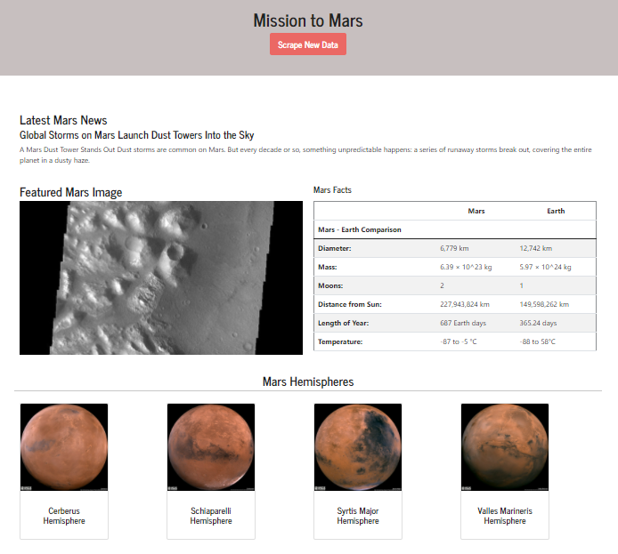

# Web-Scraping-Challenge

## Mission to Mars

This challenge involved creating a web application by scraping data from multiple websites and displaying the data in single HTML page.

### Part 1: Scraping

#### NASA Mars News

This portion involved scraping the latest headline and paragraph from a [Mars News](https://redplanetscience.com/) site.

#### JPL Mars Space Images

This portion involved scraping the feature image using splinter from the [Featured Space Image](https://spaceimages-mars.com/) site.  It grabbed the url of the featured space image.

#### Mars Facts

This portion involved scraping a table of facts about Mars and Earth from a [Mars Facts](https://galaxyfacts-mars.com/) site.  The data was scraped using pandas and converted to an HTML string.  The string was then edited for some formatting changes (centered header text and striped rows).

#### Mars Hemispheres

This portion involved scraping full size hemisphere images from an [astrogeology](https://marshemispheres.com/) site.  It used splinter to grab the hemisphere names and looped through the list to get hemisphere name and the url for each image.  Last, it created a dictionary to store all the hemisphere data.

### Part 2: MongoDB and Flask Application

The code used for scraping was then added to [scrape_mars.py](https://github.com/saleha456/Web-Scraping-Challenge/blob/main/Mission_to_Mars/scrape_mars.py) file with a function called scrape.  When this function gets executed, it will scrape all the data from the websites above and store them in a python dictionary.

#### Flask Application

A route was created called /scrape.  This imports the scrape_mars.py file and runs the scrape function, which scrapes the data and stores it in a mongo database.

The root route retrieves the data from the Mongo database and displays it in an HTML template.

#### HTML File

The HTML template takes all the data form the Mongo dictionary and displays it as HTML elements.  This HTML page is responsive.

**Final Outcome:**

